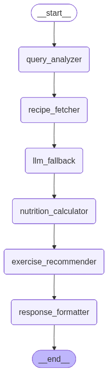

# CLAUDE.md

This file provides guidance to Claude Code (claude.ai/code) when working with code in this repository.

## Project Overview

Korean Recipe & Fitness Advisor - 한국 음식 레시피, 영양정보, 맞춤 운동 추천 AI 웹 서비스

## Common Commands

```bash
# Activate virtual environment
source venv/bin/activate

# Run Streamlit app (standalone mode - recommended)
streamlit run streamlit_app/main.py

# Run FastAPI server (optional - for API access)
uvicorn app.main:app --reload --port 8000

# Data collection (batch processing)
python scripts/collect_recipes.py      # 레시피 수집
python scripts/collect_nutrition.py    # 영양정보 수집
python scripts/process_recipes.py      # 데이터 정제
python scripts/build_vector_db.py      # FAISS 인덱스 빌드
python scripts/build_nutrition_db.py   # SQLite DB 빌드

# Run tests
pytest tests/ -v
pytest --cov=app --cov-report=html
```

## Architecture

### LangGraph 6-Agent Pipeline



```
QueryAnalyzer → RecipeFetcher → LLMFallback → NutritionCalculator → ExerciseRecommender → ResponseFormatter
```

| Agent | File | Purpose |
|-------|------|---------|
| QueryAnalyzer | `app/core/agents/query_analyzer.py` | GPT로 음식명/인분수 추출 |
| RecipeFetcher | `app/core/agents/recipe_fetcher.py` | FAISS 벡터 검색 |
| LLMFallback | `app/core/agents/llm_fallback.py` | DB에 없는 레시피/영양정보 GPT 생성 |
| NutritionCalculator | `app/core/agents/nutrition_calculator.py` | SQLite 영양정보 조회 |
| ExerciseRecommender | `app/core/agents/exercise_recommender.py` | MET 기반 운동 추천 |
| ResponseFormatter | `app/core/agents/response_formatter.py` | GPT로 최종 응답 생성 |

### Core Services

| Service | File | Purpose |
|---------|------|---------|
| LLMService | `app/core/services/llm_service.py` | GPT-4o-mini API 호출, st.secrets 지원 |
| VectorDBService | `app/core/services/vector_db_service.py` | FAISS 벡터 검색 |
| NutritionDBService | `app/core/services/nutrition_db_service.py` | SQLite 영양정보 조회 |
| CalorieCalculator | `app/core/services/calorie_calculator.py` | Mifflin-St Jeor + MET + EPOC |

### State Management

`app/core/workflow/state.py` - ChatState TypedDict:
- `analyzed_query`: 파싱된 쿼리 (food_name, servings)
- `recipe`: 레시피 정보 (ingredients, instructions, image_url)
- `recipe_source`: "database" | "llm_fallback"
- `nutrition`: 영양정보 (calories, protein, fat, carbohydrate)
- `exercise`: 운동 추천 목록

## Environment Variables

`.env` 또는 `.streamlit/secrets.toml`:
```
OPENAI_API_KEY=sk-...
RECIPE_API_KEY=...          # 공공데이터포털 레시피 API
NUTRITION_API_KEY=...       # 공공데이터포털 영양정보 API
```

## Streamlit Cloud Deployment

1. `data/processed/recipes.json` (~2MB) - 포함됨
2. `data/vector_db/*` (~7MB) - 포함됨
3. `data/database/nutrition.db` (~53MB) - **제외됨** (gitignore)
4. `data/processed/nutrition.json` (~120MB) - **제외됨** (gitignore)

**영양정보 DB 없이 배포 시**: LLMFallback이 GPT로 영양정보 추정

Secrets 설정 (Streamlit Cloud → Settings → Secrets):
```toml
OPENAI_API_KEY = "sk-..."
RECIPE_API_KEY = "..."
NUTRITION_API_KEY = "..."
```

## Data Flow

```
[배치 처리]
공공데이터 API → scripts/collect_*.py → data/raw/
                → scripts/process_recipes.py → data/processed/recipes.json
                → scripts/build_vector_db.py → data/vector_db/faiss.index
                → scripts/build_nutrition_db.py → data/database/nutrition.db

[실시간 처리]
User Query → QueryAnalyzer (GPT) → RecipeFetcher (FAISS)
           → LLMFallback (GPT, if needed) → NutritionCalculator (SQLite)
           → ExerciseRecommender (MET) → ResponseFormatter (GPT) → Response
```

## Calorie Calculation

- **BMR**: Mifflin-St Jeor 공식 (성별, 나이, 체중, 키)
- **MET**: Compendium of Physical Activities 2024 기준
- **EPOC**: 운동 후 추가 칼로리 소모 (고강도 +15%, 중강도 +7%)

## API Endpoints

- `POST /api/search` - 음식 검색 및 운동 추천
- `GET /api/health` - 헬스체크
